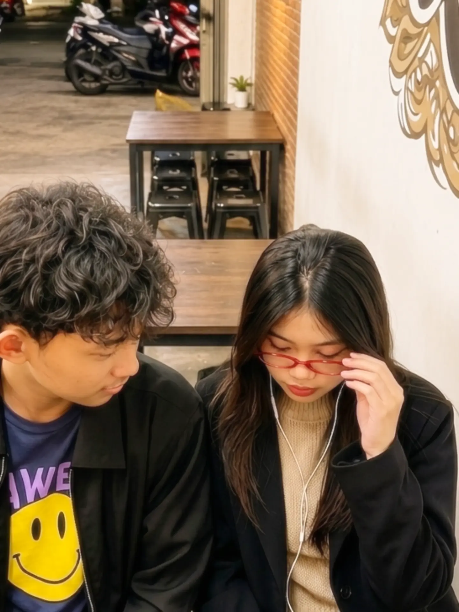

  

  

 

<!-- Photo Gallery Section -->

  <table border="0" style="border-collapse: separate; border-spacing: 20px;">
    <tr>
      <td align="center" valign="top" width="280" style="background: #1e1e2e; border: 2px solid #38bdf8; border-radius: 16px; padding: 14px;">
        
          
        <b>☕ Chill Vibe & Good Times</b>
      </td>
      <td align="center" valign="top" width="280" style="background: #1e1e2e; border: 2px solid #ec4899; border-radius: 16px; padding: 14px;">
        
          
        <b>🎵 Moths by Conan Gray</b>
      </td>
    </tr>
  </table>

 

<!-- About Me Section -->

  <h2>🌿 About Me</h2>
  

    🎯 <b>Focus:</b> Building high-performance, responsive web applications that solve real-world problems. 
    💡 <b>Passions:</b> Modern frontend architectures, interactive UI/UX, React, and Next.js. 
    🛠️ <b>Tech Stack:</b> JavaScript, React, Next.js, PHP, Laravel, Tailwind CSS, Firebase. 
    📖 <b>Growth:</b> Continuously mastering modern web standards, API design, and clean architecture. 
    🌍 <b>Collaboration:</b> Open for innovative open-source projects, personal builds, and team collabs. 
    ☕ <b>Philosophy:</b> <i>"Every great project starts with a calm mind, creative code, and a simple idea."</i> 
    🍃 <b>Vibe:</b> Calm individual, passionate developer & avid music listener.
  

 

<!-- Tech Stack & Skills Section -->

  <h2>🚀 Tech Stack & Skills</h2>

  <!-- Languages -->
  

    
    
    
    
  

  <!-- Frameworks & Libraries -->
  

    
    
    
    
  

  <!-- Tools & Backend -->
  

    
    
    
    
  

   

  <!-- DevIcons Row -->
  

    
    &nbsp;&nbsp;
    
    &nbsp;&nbsp;
    
    &nbsp;&nbsp;
    
    &nbsp;&nbsp;
    
    &nbsp;&nbsp;
    
    &nbsp;&nbsp;
    
    &nbsp;&nbsp;
    
    &nbsp;&nbsp;
    
    &nbsp;&nbsp;
    
  

 

<!-- Trophies Section -->

  <h2>🏆 GitHub Trophies</h2>
  

 

<!-- Animated Contribution Graph -->

  <h2>🎮 Contribution Snake & Arcade</h2>
  
  <!-- Snake Eating Contributions Animation -->
  <picture>
    <source media="(prefers-color-scheme: dark)" srcset="https://raw.githubusercontent.com/LyanDSam/LyanDSam/output/github-contribution-grid-snake-dark.svg" />
    <source media="(prefers-color-scheme: light)" srcset="https://raw.githubusercontent.com/LyanDSam/LyanDSam/output/github-contribution-grid-snake.svg" />
    
  </picture>

    

  <!-- Pacman Contribution Animation -->
  <picture>
    <source media="(prefers-color-scheme: dark)" srcset="https://raw.githubusercontent.com/LyanDSam/LyanDSam/pacman-output/pacman-contribution-graph-dark.svg" />
    <source media="(prefers-color-scheme: light)" srcset="https://raw.githubusercontent.com/LyanDSam/LyanDSam/pacman-output/pacman-contribution-graph.svg" />
    
  </picture>

 

<!-- Dynamic Stats Cards -->

  <h2>📊 GitHub Stats & Activity</h2>
  
  

    
    &nbsp;
    
  

  

    
  

 

<!-- Spotify / Music Corner -->

  <h2>🎵 Music is My Life</h2>
  
  
<i>"Music fuels my daily coding sessions 🎧"</i>

  
  

 

<!-- Animated Footer Banner -->

  

